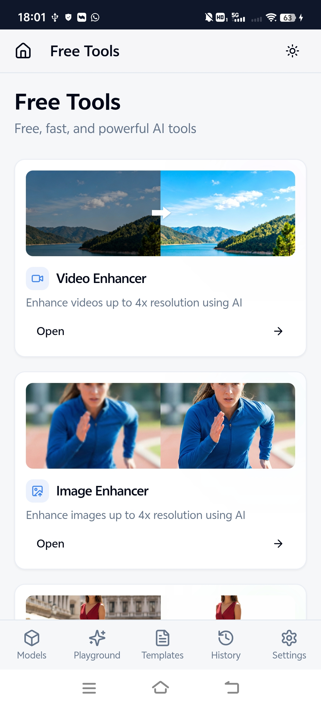
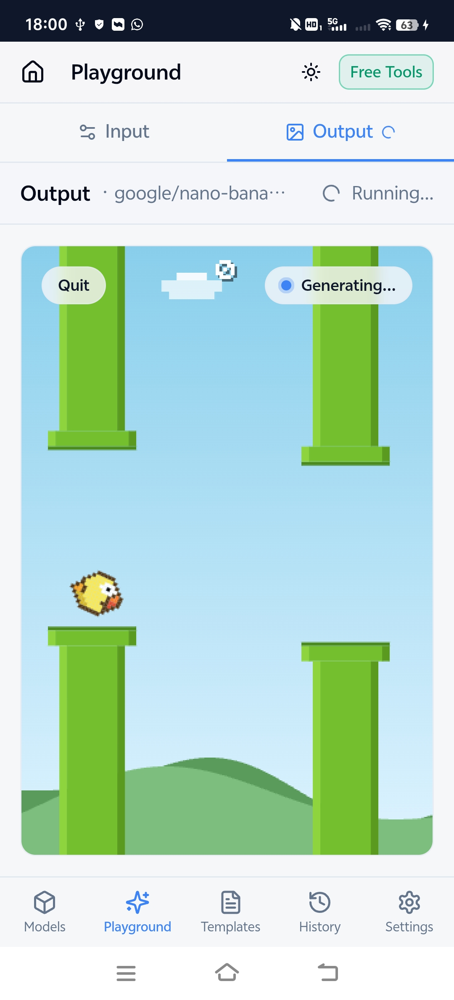

# WaveSpeed

Official cross-platform application for running 1000+ AI models — image generation, video generation, face swap, digital human, motion control, and more. WaveSpeed includes a visual workflow editor for building AI pipelines, Featured Models with smart variant switching, and 12 free creative tools for **Windows**, **macOS**, **Linux**, and **Android**.

[All stable releases](https://github.com/WaveSpeedAI/wavespeed-desktop/releases) · [Nightly builds](https://github.com/WaveSpeedAI/wavespeed-desktop/releases/tag/nightly)

## Features

- **AI Playground**: Multi-tab playground with dynamic forms, batch processing, mask drawing, LoRA support, abort control, and automatically randomized seeds
- **Featured Models**: Curated model families with smart variant switching that selects the appropriate variant based on your inputs and options
- **Model Browser**: Search, sort by popularity, name, price, or type, and filter favorites
- **Visual Workflow Editor**: Node-based pipeline builder with AI tasks, creative tools, media processing, reusable groups, batch runs, and real-time execution monitoring
- **Creative Studio**: 12 free AI-powered image, video, audio, and media tools
- **Local Image Generation**: Generate images locally with downloadable models, progress information, and logs
- **Templates**: Playground and workflow templates with presets, search, import, export, and usage tracking
- **History & Assets**: Recent predictions and saved outputs with tags, favorites, search, and automatic local saving
- **Media Input**: File upload, drag and drop, camera capture, and video or audio recording
- **Cross-platform**: Windows, macOS, Linux, and Android with 18 languages, dark and light themes, and stable or nightly update channels

## Android App

WaveSpeed Mobile brings the AI Playground, Featured Models, Creative Studio, model browser, history, assets, and templates to your Android phone.

- Full AI Playground with multi-tab support and camera capture
- Featured Models with smart variant switching
- Model browser with search, filter, and sorting
- Creative Studio tools including face enhancement, background removal, image erasing, segmentation, and media conversion
- History, My Assets, templates, and automatic saving
- 18 languages, dark and light themes, Android 5.1+ (API 22)

  
  

## [Creative Studio](https://wavespeed.ai/studio)

12 free AI-powered creative tools that run in your browser. No API key is required. Creative Studio is built into WaveSpeed and is also available as a responsive standalone web app at [wavespeed.ai/studio](https://wavespeed.ai/studio).

| Tool                   | Description                                                           |
| ---------------------- | --------------------------------------------------------------------- |
| **Image Enhancer**     | Upscale images 2x–4x with multiple quality options                    |
| **Video Enhancer**     | Frame-by-frame video upscaling with progress and ETA                  |
| **Face Enhancer**      | Detect and enhance faces with browser-accelerated processing          |
| **Face Swapper**       | Swap faces with optional post-processing                              |
| **Background Remover** | Remove backgrounds and download the foreground, background, or mask   |
| **Image Eraser**       | Remove unwanted objects with inpainting, smart cropping, and blending |
| **Segment Anything**   | Select and segment objects with interactive point prompts             |
| **Video Converter**    | Convert between MP4, WebM, AVI, MOV, and MKV formats                  |
| **Audio Converter**    | Convert between MP3, WAV, AAC, FLAC, and OGG formats                  |
| **Image Converter**    | Batch convert JPG, PNG, WebP, GIF, and BMP images                     |
| **Media Trimmer**      | Trim video and audio by selecting start and end times                 |
| **Media Merger**       | Merge multiple video or audio files into one                          |

## Visual Workflow Editor

Design and run complex AI workflows with a node-based pipeline builder. Chain AI models, creative tools, and media-processing steps into reusable automated workflows.

- Build with AI tasks, media input and output, processing, trigger, and creative-tool nodes
- Run an entire workflow or an individual node, continue, retry, cancel, and execute batches
- Monitor execution and estimated cost in real time
- Organize reusable subgraphs and import or export workflows
- Process a directory of media files automatically
- Use prompt optimization, result caching, cycle detection, undo and redo, and customizable output names

## Installation

Use the platform buttons at the top of this page to download the latest stable release, or browse the [complete release history](https://github.com/WaveSpeedAI/wavespeed-desktop/releases).

<b>Windows</b>

1. Download the `.exe` installer from the Windows button above.
2. Run the installer and follow the prompts.
3. Launch **WaveSpeed Desktop** from the Start menu.

<b>macOS</b>

1. Download the `.dmg` for your Mac: Apple Silicon or Intel.
2. Open the disk image and drag WaveSpeed to Applications.
3. Launch the app from Applications.

<b>Linux</b>

1. Download the `.AppImage` from the Linux button above, or a `.deb` package from the release page.
2. For AppImage, make the file executable with `chmod +x WaveSpeed-Desktop-*.AppImage`, then run it.
3. For Debian-based distributions, install the `.deb` package with your system package installer.

<b>Android</b>

1. Download `WaveSpeed-Mobile.apk` from the Android button above.
2. Open the APK on your Android device.
3. If prompted, temporarily allow installation from the browser or file manager you used.
4. Install over the existing WaveSpeed app when upgrading; uninstalling first can remove local app data.
5. Launch the app, then optionally disable installation from that source again.
6. Android 5.1 (API 22) or later is required.

### Nightly Builds

Nightly builds contain the newest changes but may be unstable. Use the stable release for regular use.

## Configuration

1. Launch WaveSpeed.
2. Open **Settings**.
3. Enter your WaveSpeedAI API key.
4. Open the Playground and select a model.

Get an API key from [WaveSpeedAI](https://wavespeed.ai).

## Verify Official Builds

Only install packages downloaded from this repository or linked from [wavespeed.ai](https://wavespeed.ai). Do not install repackaged builds from third-party websites, app stores, chat groups, or file-sharing services.

GitHub displays a SHA-256 digest for each uploaded release asset. Compare that digest before installing a file obtained through a mirror. New releases also include a `SHA256SUMS` manifest.

The GitHub organization, repository URL, website domain, application name, icons, and code-signing identities are part of the official distribution identity. A similarly named repository or application is not an official WaveSpeed release unless it is linked from this page or from `wavespeed.ai`.

## Support, Security, and Links

- [WaveSpeed website](https://wavespeed.ai)
- [Creative Studio](https://wavespeed.ai/studio)
- [API documentation](https://wavespeed.ai/docs)
- [GitHub Issues](https://github.com/WaveSpeedAI/wavespeed-desktop/issues) for application problems
- [SECURITY.md](SECURITY.md) for security or impersonation reports
- [TRADEMARKS.md](TRADEMARKS.md) for brand-use restrictions

This repository distributes official WaveSpeed application releases and does not contain the application source code.

Copyright © 2025–2026 WaveSpeedAI. All rights reserved.
